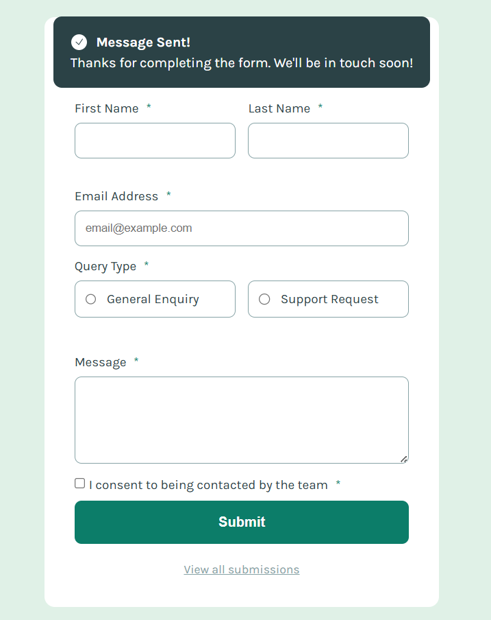

# Solución del formulario de contacto - Evaluación Diagnóstica

## Tabla de contenidos

-   [Resumen]
  - [El desafío]
  - [Captura de pantalla]
  - [Enlaces]
-   [Mi proceso]
  - [Tecnologías utilizadas]
  - [Configuración del Proyecto]
-   [Autor](Carlos Alberto Tec Mex)

## Resumen

Este proyecto consiste en el desarrollo de un formulario de contacto funcional y accesible, integrando tanto el frontend (HTML5, CSS3, JS) como el backend (PHP, MySQL). La aplicación permite capturar mensajes de usuarios, validarlos y almacenarlos de forma segura en un servidor.

### El desafío

Tus usuarios pueden:

- Completar el formulario y ver un mensaje de éxito que desaparece automáticamente después de 5 segundos.
- Recibir mensajes de validación si los campos obligatorios están vacíos o el formato del email es incorrecto.
- Navegar y enviar el formulario utilizando únicamente el teclado.
- Visualizar el diseño de forma óptima en cualquier dispositivo (móvil, tablet o escritorio).
- Interactuar con estados de hover y focus en todos los elementos del formulario.
- **Backend:** Los datos se procesan mediante PHP y se guardan en una base de datos MySQL.
- **Consulta:** El sistema permite recuperar y visualizar todos los envíos realizados en una tabla dinámica.

### Captura de pantalla

### Enlaces

- **URL en GITHUB de mi proyecto:** [https://github.com/221k0028-svg/Evalucion-Diagnositca]
- **URL del site (InfinityFree):** [http://evaluacion-formulario.infinityfree.me/]

## Mi proceso

### Tecnologías utilizadas

- HTML5 y CSS3 (Custom properties, Flexbox, Grid).
- JavaScript Vanilla para validaciones y efectos del banner.
- PHP para el procesamiento de datos del lado del servidor.
- MySQL para la persistencia de datos.
- Laragon / InfinityFree como entornos de servidor.

### Configuración del Proyecto

1. **Base de Datos:** Importar el archivo `database.sql` incluido en este repositorio para crear la estructura de la base de datos `contacto_db` y la tabla `mensajes`.
2. **Conexión:** Configurar las credenciales en el archivo `db.php` según su entorno (Localhost o Hosting).
3. **Acceso:** Abrir `index.php` para enviar mensajes y `ver_mensajes.php` para consultar la base de datos.

## Autor
- **Nombre completo:** [Carlos Alberto Tec Mex]
- **N° Control:** [221K0028]
- **Grupo:** [8A]
- **Sitio Web:** [Carlos Tec][http://evaluacion-formulario.infinityfree.me/]

- **Github:** [Carlos Tec](https://github.com/221k0028-svg/Evalucion-Diagnositca)
